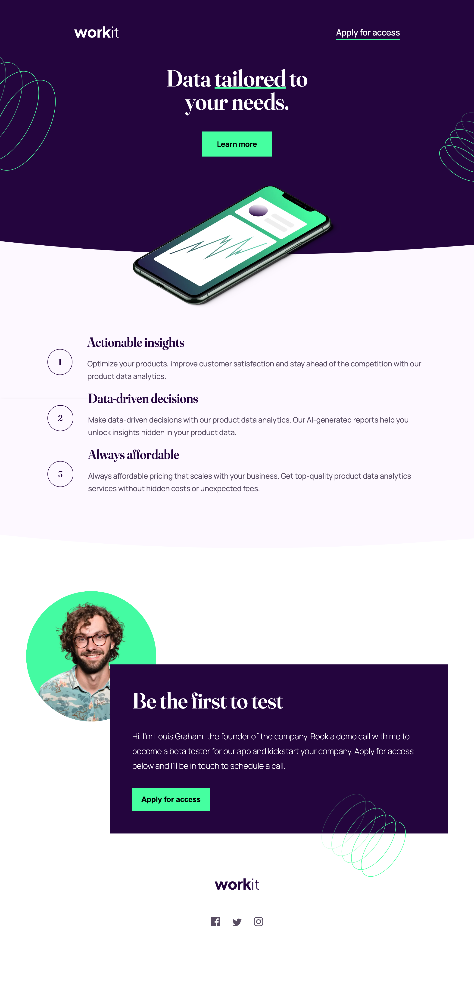

# Frontend Mentor - Workit landing page solution

This is a solution to the [Workit landing page challenge on Frontend Mentor](https://www.frontendmentor.io/challenges/workit-landing-page-2fYnyle5lu). Frontend Mentor challenges help you improve your coding skills by building realistic projects. 

## Table of contents

- [Overview](#overview)
  - [The challenge](#the-challenge)
  - [Screenshot](#screenshot)
  - [Links](#links)
- [My process](#my-process)
  - [Built with](#built-with)
  - [What I learned](#what-i-learned)
  - [Useful resources](#useful-resources)
- [Author](#author)
- [Acknowledgments](#acknowledgments)


## Overview

### The challenge

Users should be able to:

- View the optimal layout for the interface depending on their device's screen size
- See hover and focus states for all interactive elements on the page

### Screenshot





### Links

- Solution URL: [GitHub](https://github.com/RaviBele/FrontEnd-WorkitLandingPage)
- Live Site URL: [Netlify](https://bright-kleicha-0875d7.netlify.app/)

## My process

### Built with

- Semantic HTML5 markup
- CSS custom properties
- Flexbox
- Adding curves using SVG
- Media queries


### What I learned

Use this section to recap over some of your major learnings while working through this project. Writing these out and providing code samples of areas you want to highlight is a great way to reinforce your own knowledge.

To see how you can add code snippets, see below:

```html
 <div class="curve">
                <svg data-name="Layer 1" xmlns="http://www.w3.org/2000/svg" viewBox="0 0 1200 120" preserveAspectRatio="none">
                    <path d="M321.39,56.44c58-10.79,114.16-30.13,172-41.86,82.39-16.72,168.19-17.73,250.45-.39C823.78,31,906.67,72,985.66,92.83c70.05,18.48,146.53,26.09,214.34,3V0H0V27.35A600.21,600.21,0,0,0,321.39,56.44Z" class="shape-fill"></path>
                </svg>
            </div>
```
```css
.curve {
    position: absolute;
    top: 99.94%;
    left: 0;
    width: 100%;
    overflow: hidden;
    line-height: 0;
    z-index: 1;
}

.curve svg {
    position: relative;
    display: block;
    width: calc(300% + 1.3px);
    height: 89px;
}

.curve .shape-fill {
    fill: #24053E;
}
```

### Useful resources

- [Create curves using svg tag](https://www.shapedivider.app/) - This helped me for creating curves. I really liked this shapes and will use it going forward.


## Author

- Frontend Mentor - [@RaviBele](https://www.frontendmentor.io/profile/RaviBele)


## Acknowledgments

This is where you can give a hat tip to anyone who helped you out on this project. Perhaps you worked in a team or got some inspiration from someone else's solution. This is the perfect place to give them some credit.
